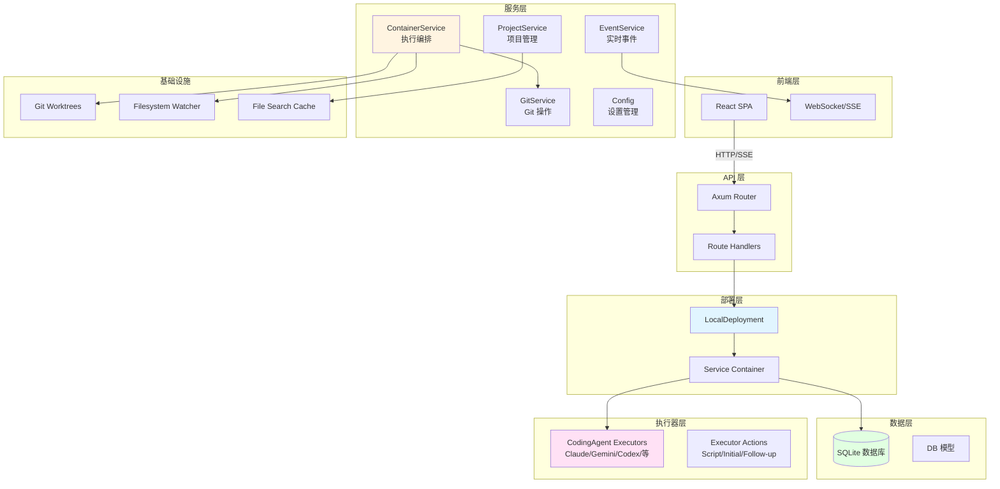
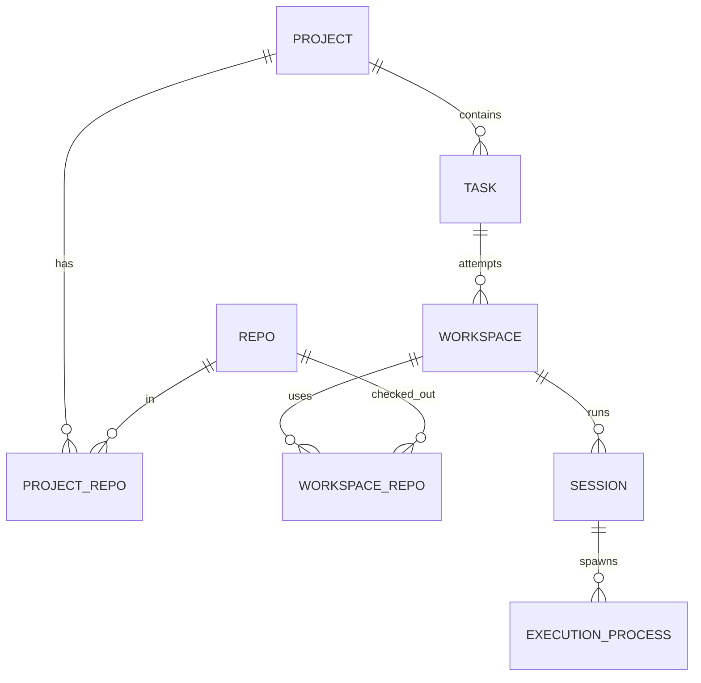
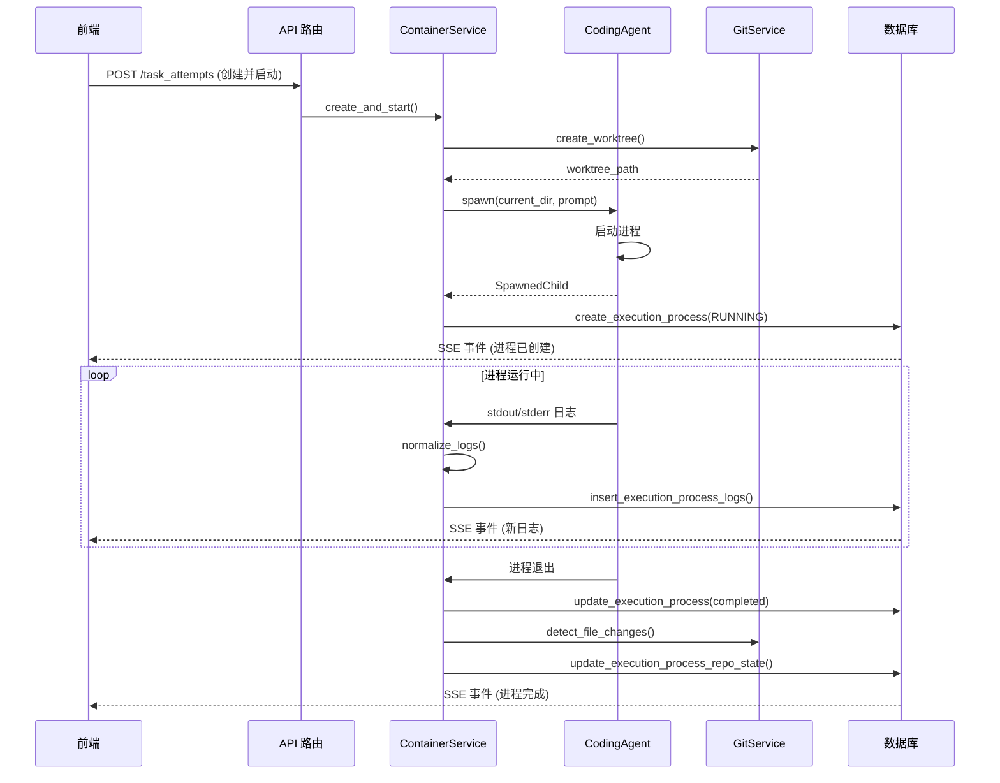
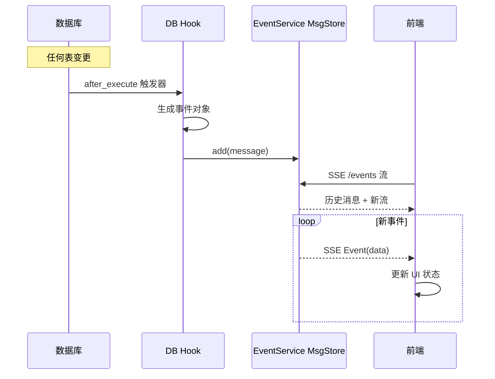
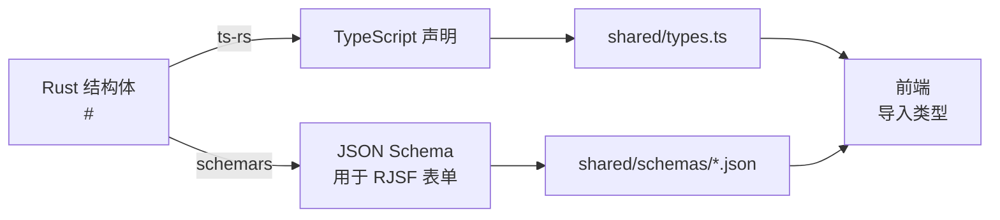
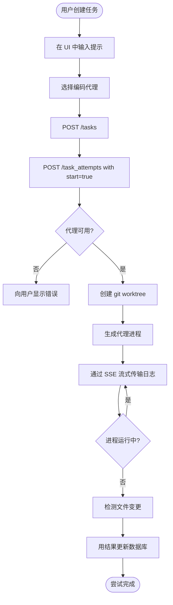
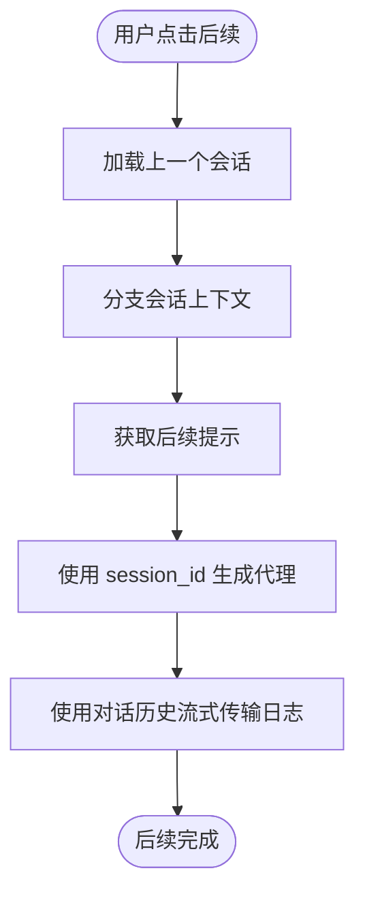
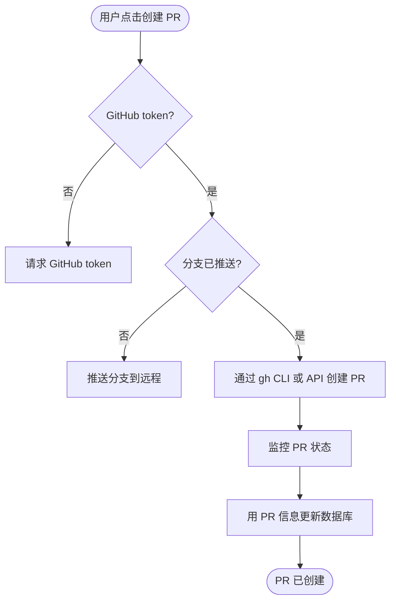
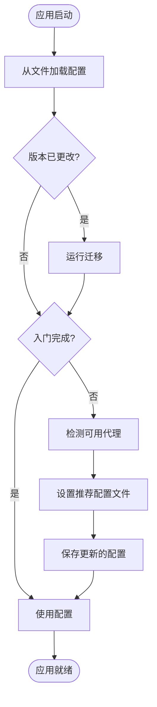

# Vibe Kanban 架构

## 项目概述

Vibe Kanban 是一个为 AI 编码代理设计的任务管理和编排系统。它提供了基于 Web 的看板界面，用于管理任务、执行多个编码代理（Claude Code、Gemini、Codex、Cursor 等）、跟踪进度并审查工作。

该应用程序采用 **Rust + TypeScript 混合架构**：
- **后端**：使用 Axum Web 框架、SQLite 数据库和进程执行的 Rust 服务器
- **前端**：使用 Vite 构建的 React + TypeScript SPA，支持实时 WebSocket/SSE 连接
- **类型安全**：使用 `ts-rs` 从 Rust 结构体自动生成 TypeScript 类型

## 技术栈

### 后端 (Rust)
- **Web 框架**：Axum 0.8（支持 WebSocket 的异步 HTTP）
- **数据库**：SQLite + SeaORM（异步 ORM）
- **运行时**：Tokio（异步运行时）
- **核心库**：
  - `ts-rs`：从 Rust 结构体生成 TypeScript 类型
  - `git2`：Git 仓库操作
  - `rmcp`：MCP（模型上下文协议）服务器实现
  - `sea-orm`：异步 ORM + SeaQuery 查询构建
  - `sea-orm-migration`：迁移管理
  - `axum` + `tower-http`：支持 CORS、跟踪、请求 ID 的 HTTP 服务器

### 前端 (TypeScript/React)
- **框架**：React 18 + TypeScript
- **构建工具**：Vite
- **状态管理**：Zustand + React Query
- **UI 组件**：Radix UI 原语 + Tailwind CSS
- **核心库**：
  - `@tanstack/react-query`：服务器状态管理
  - `@dnd-kit`：看板拖放
  - `lexical`：富文本编辑器
  - `@git-diff-view/react`：Git diff 可视化
  - `react-virtuoso`：大列表虚拟滚动

## 系统架构

系统遵循**分层服务架构**，在 HTTP 层、业务逻辑和数据持久化之间有清晰的分离：



## 核心组件

### 1. 部署抽象 (`crates/deployment/`, `crates/local-deployment/`)

**Deployment trait** (`//crates/deployment/src/lib.rs`) 为服务容器提供了清晰的抽象。这使得同一代码库可以支持不同的部署模式（目前是本地部署，未来可能支持云端部署）。

**核心职责**：
- 服务生命周期管理（初始化、启动、关闭）
- 集中访问所有服务（配置、数据库、git、项目等）
- 后台服务生成（PR 监控、清理任务）
- 新用户自动项目设置

**实现**：`LocalDeployment` (`//crates/local-deployment/src/lib.rs`) 是将所有服务组合在一起用于本地使用的具体实现。

### 2. API 层 (`crates/server/`)

服务器 crate 提供前端使用的 HTTP API。

**结构** (`//crates/server/src/routes/`):
- `routes/mod.rs`：组合所有路由模块的主路由器
- `routes/projects.rs`：项目 CRUD 操作
- `routes/task_attempts.rs`：任务尝试管理（执行、日志、PR 创建）
- `routes/sessions/`：实时会话管理
- `routes/config.rs`：用户配置管理
- `routes/events.rs`：实时更新的服务器发送事件 (SSE) 端点
- `routes/repo.rs`：仓库注册和初始化
- `routes/filesystem.rs`：文件系统浏览和搜索
- `routes/images.rs`：任务的截图/图片管理

**中间件** (`//crates/server/src/middleware/`):
- 请求 ID 生成
- 模型加载器（从路径参数自动加载数据库模型）
- CORS 和跟踪

**类型生成** (`//crates/server/src/bin/generate_types.rs`):
- 从 Rust 结构体提取 TypeScript 类型定义
- 为代理配置表单生成 JSON schema
- 通过 `pnpm run generate-types` 运行

### 3. 数据库层 (`crates/db/`)

**模型** (`//crates/db/src/models/`):
- `project.rs`：项目（仓库和任务的集合）
- `task.rs`：具有状态的看板任务（待办、进行中、已完成、已取消等）
- `session.rs`：编码代理会话（可分支的对话上下文）
- `execution_process.rs`：运行的代理进程（尝试）
- `execution_process_logs.rs`：代理执行的原始日志
- `repo.rs`、`project_repo.rs`、`workspace_repo.rs`：仓库关系
- `tag.rs`：用于组织的任务标签
- `scratch.rs`：后续提示的草稿内容
- `image.rs`：附加到任务的截图
- `workspace.rs`：项目工作区（包含 git worktrees）

**实体关系（Attempt = Workspace）**：



说明：MCP 里统一使用 **attempt** 概念，当前代码中 `attempt_id == workspace.id`。

**核心设计**：所有模型使用 `ts-rs` derive 自动生成 TypeScript 类型，确保跨 FFI 边界的类型安全。

### 4. 服务层 (`crates/services/src/services/`)

业务逻辑组织为专注的服务：

#### ContainerService (`container.rs`)
**核心编排服务**，管理编码代理执行。

**核心职责**：
- 在隔离的 git worktrees 中生成编码代理进程
- 管理执行生命周期（启动、监控、终止、清理）
- 会话管理（为后续任务分支对话）
- 日志规范化和流式传输到前端
- 批准工作流集成
- PR 创建和分支管理

#### GitService (`git.rs`)
`git2` 的包装器，提供高级 git 操作：
- 分支创建、切换、重命名
- 提交和合并操作
- Worktree 管理
- Diff 生成
- 冲突检测和解决

#### ProjectService & RepoService
项目和仓库管理：
- 项目 CRUD 及关联仓库
- 仓库注册和初始化
- 搜索和过滤
- 工作区管理

#### EventService (`events.rs`)
实时事件广播到前端：
- 可配置历史记录的消息存储
- SSE 流式传输到连接的客户端
- 数据库更改挂钩以自动生成事件
- 用于增量更新的 JSON Patch 生成

#### FileSearchCache (`file_search_cache.rs`)
性能优化服务：
- 项目文件的后台索引
- 跨仓库的快速模糊搜索
- 带 TTL 的 LRU 缓存
- 活动项目的预热策略

#### Cache Budgeting（缓存预算）
后端缓存预算通过环境变量控制（条目数 + TTL，单位秒）。服务启动时会记录当前预算与缓存大小，并在接近预算时采样警告。

常用环境变量（默认值）：
- `VK_FILE_SEARCH_CACHE_MAX_REPOS=25`
- `VK_FILE_SEARCH_CACHE_TTL_SECS=3600`
- `VK_FILE_SEARCH_MAX_FILES=200000`
- `VK_FILE_SEARCH_WATCHERS_MAX=25`
- `VK_FILE_SEARCH_WATCHER_TTL_SECS=21600`
- `VK_FILE_STATS_CACHE_MAX_REPOS=25`
- `VK_FILE_STATS_CACHE_TTL_SECS=3600`
- `VK_APPROVALS_COMPLETED_TTL_SECS=86400`
- `VK_QUEUED_MESSAGES_TTL_SECS=86400`
- `VK_LOG_BACKFILL_COMPLETION_MAX_ENTRIES=10000`
- `VK_LOG_BACKFILL_COMPLETION_TTL_SECS=86400`
- `VK_LOG_BACKFILL_CONCURRENCY=4`
- `VK_CACHE_WARN_AT_RATIO=0.9`
- `VK_CACHE_WARN_SAMPLE_SECS=300`
- `VK_LOG_HISTORY_MAX_BYTES=8388608`
- `VK_LOG_HISTORY_MAX_ENTRIES=5000`
- `VK_NORMALIZED_LOG_HISTORY_PAGE_SIZE=20`
- `VK_RAW_LOG_HISTORY_PAGE_SIZE=200`

备注：
- TTL 设置为 `0` 时禁用过期清理（仅保留条目上限约束）。
- 条目上限为 `0` 时会被提升到最小值 `1` 以避免缓存被完全禁用。

#### Config Service (`config/`)
用户设置管理：
- 版本化配置 schema（启动时迁移）
- 执行器配置文件（代理配置）
- 编辑器集成设置
- GitHub token 存储
- 主题、语言、通知偏好

#### 其他服务
- `FilesystemService`：文件系统浏览、搜索、git 仓库发现
- `ImageService`：截图存储和孤儿清理
- `Approvals`：代理操作的批准工作流
- `QueuedMessageService`：延迟传递的消息队列
- `PrMonitorService`：后台 PR 状态监控
- `NotificationService`：桌面通知

### 5. 执行器层 (`crates/executors/`)

不同编码代理实现的抽象。

#### 核心 Traits (`executors/mod.rs`)
**`StandardCodingAgentExecutor`** trait 定义了所有代理必须实现的接口：
```rust
async fn spawn(&self, current_dir, prompt, env) -> Result<SpawnedChild>
async fn spawn_follow_up(&self, current_dir, prompt, session_id, env) -> Result<SpawnedChild>
fn normalize_logs(&self, raw_logs, worktree_path)
fn default_mcp_config_path(&self) -> Option<PathBuf>
```

#### 支持的代理 (`executors/`)
- `claude/`：Anthropic Claude Code
- `gemini/`：Google Gemini CLI
- `codex/`：OpenAI Codex
- `cursor/`：Cursor IDE agent
- `amp/`：Amp agent
- `opencode/`：OpenCode agent
- `qwen/`：QwenCode
- `copilot/`：GitHub Copilot CLI
- `droid/`：Droid agent
- `fake_agent/`：Fake agent（可复现模拟器）

每个代理目录包含：
- 客户端协议实现
- 会话管理
- 日志解析/规范化
- MCP（模型上下文协议）配置

#### Fake Agent 本地复现
- 构建二进制：`cargo build -p executors --bin fake-agent`
- 使用临时 dev 资产/数据库：`VIBE_ASSET_DIR=$(mktemp -d)` 后执行 `pnpm run dev`
- Settings -> Task Execution 选择 `FAKE_AGENT`（或在 `profiles.json` 中设置）
- 如需指定路径/命令：设置 `VIBE_FAKE_AGENT_PATH`
- 脚本场景：在配置里设置 `scenario_path` 指向 JSONL
- apply_patch 模拟会写入工作区下 `__fake_agent__<suffix>/` 以触发 diff

#### Actions (`actions/`)
**ExecutorAction** 枚举表示代理可以执行的离散操作：
- `CodingAgentInitialRequest`：开始新对话
- `CodingAgentFollowUpRequest`：继续现有对话
- `ScriptRequest`：执行 shell 脚本

#### Profile System (`profile.rs`)
**ExecutorProfileId** 和 **ExecutorConfigs** 管理代理配置：
- 从用户系统发现配置文件
- 自动检测可用代理
- 配置文件特定设置（模型、参数等）

#### Log Normalization (`logs/`)
将代理特定的输出转换为统一格式：
- `NormalizedEntry`：标准化日志条目类型
- 每个代理格式的解析器
- 工具提取（文件更改、命令结果、todos）
- 用于前端显示的对话 patch 生成

### 6. Utils (`crates/utils/`)

共享工具：
- `assets.rs`：资产目录管理
- `msg_store.rs`：带历史的内存消息存储
- `log_msg.rs`：日志消息类型
- `text.rs`：文本工具（分支 ID 生成、UUID 缩短）
- `diff.rs`：Diff 生成和格式化
- `approvals.rs`：批准类型和状态
- `response.rs`：API 响应包装器

## 数据流

### 任务执行流程



### 实时事件流程



### 类型生成流程



## 关键架构模式

### 1. 服务容器模式
`Deployment` trait 充当服务定位器，提供对所有服务的集中访问。这使得：
- 易于进行测试的依赖注入
- 服务实例的单一真实来源
- 清晰的服务生命周期管理

### 2. 基于 Trait 的抽象
关键行为定义为 traits：
- `Deployment`：服务容器抽象
- `ContainerService`：执行编排接口
- `StandardCodingAgentExecutor`：代理执行接口
- `ExecutorApprovalService`：批准工作流接口

这允许多种实现（例如，`LocalDeployment` vs `CloudDeployment`）。

### 3. 消息存储模式
`MsgStore` (`//crates/utils/src/msg_store.rs`) 提供：
- 有界的内存消息历史
- 通过通道的实时流式传输
- 用于 HTTP 流式传输的 SSE 集成
- 用于事件、日志和会话

### 4. Git Worktree 隔离
每次执行都在隔离的 git worktree 中进行：
- 防止并发执行之间的冲突
- 允许安全的并行代理运行
- 易于清理（尝试后删除 worktree）
- 每次尝试分支工作流

### 5. 事件驱动更新
数据库更改自动触发事件：
- SeaORM 写入时入队 `event_outbox`
- EventService 轮询 outbox 并派发补丁
- 前端通过 SSE 接收实时更新
- 无需轮询

### 6. 类型安全的 FFI
Rust ↔ TypeScript 边界完全类型安全：
- Rust 中的单一真实来源
- `ts-rs` 生成 TypeScript 定义
- 双方的构建时类型检查
- 表单的 JSON Schema 生成

### 7. 全面的异步/等待
- 所有异步操作的 Tokio 运行时
- HTTP、数据库、进程的非阻塞 I/O
- 使用 `tokio::spawn` 的结构化并发
- 优雅的关闭处理

## 前端架构

### 页面结构
- `Projects`：项目列表和创建
- `ProjectTasks`：带任务列的看板
- `FullAttemptLogs`：VS Code 风格的日志查看器
- `Settings`：多标签设置（常规、项目、代理、MCP）

### 状态管理
- **Zustand stores**：客户端状态 (`//frontend/src/stores/`)
- **React Query**：带缓存和失效的服务器状态
- **Context providers**：主题、搜索、点击的元素

### 核心 Hooks (`//frontend/src/hooks/`)
- `useAttempt`：任务尝试数据和操作
- `useAttemptExecution`：启动/停止/重试执行
- `useAttemptBranch`：分支管理（推送、重命名、rebase）
- `useAttemptConflicts`：合并冲突解决
- `useConversationHistory`：消息流式传输和补丁
- `useAgentAvailability`：检测已安装的代理

### 组件组织
```
components/
├── ui/           # 可重用的 UI 原语（按钮、输入等）
├── layout/       # 布局组件（侧边栏、标题）
├── dialogs/      # 模态对话框（按域组织）
├── kanban/       # 看板特定组件
└── forms/        # 表单组件（基于 RJSF）
```

## 关键工作流

### 1. 创建和运行任务



**关键文件**：
- 前端：`//frontend/src/hooks/useAttemptCreation.ts`
- 后端：`//crates/server/src/routes/task_attempts.rs` (create_and_start endpoint)
- Container：`//crates/services/src/services/container.rs` (create_and_start method)

### 2. 后续对话



**关键文件**：
- 前端：`//frontend/src/hooks/useConversationHistory.ts`
- 后端：`//crates/services/src/services/container.rs` (follow_up method)
- Executors：`//crates/executors/src/executors/mod.rs` (spawn_follow_up trait)

### 3. 创建拉取请求



**关键文件**：
- 前端：`//frontend/src/components/dialogs/task/` 中的 PR 创建对话框
- 后端：`//crates/server/src/routes/task_attempts/pr.rs`
- GitHub：`//crates/services/src/services/github.rs`

### 4. 配置管理



**关键文件**：
- 配置服务：`//crates/services/src/services/config/mod.rs`
- 迁移：`//crates/services/src/services/config/versions/`
- 前端：`//frontend/src/components/ConfigProvider.tsx`

## 部署模型

### 本地部署（当前）
单机部署：
- `~/.vibe-kanban/data/` 中的 SQLite 数据库
- `~/.vibe-kanban/config.json` 中的配置
- `~/.vibe-kanban/worktrees/` 中的 Git worktrees
- `~/.vibe-kanban/assets/` 中的资产
- 本地构建的单个二进制文件

### 远程部署
在具有 SSH 访问权限的远程服务器上运行：
- 通过隧道暴露的 Web UI（Cloudflare、ngrok）
- VSCode Remote-SSH 集成
- 映射到远程文件系统的项目路径
- 相同的架构，不同的网络拓扑

## 开发工作流

### 类型安全工作流
```bash
# 1. 修改 Rust 类型（添加字段、更改结构体）
# 2. 运行类型生成
pnpm run generate-types

# 3. 前端现在有更新的类型
# 4. TypeScript 将捕获类型不匹配
pnpm run check
```

### 数据库迁移
```bash
# 1. 在 crates/db/migration/src 中创建迁移
# 2. 运行 SeaORM 迁移
pnpm run prepare-db

# 3. 运行检查
cargo check
```

### 前端开发
```bash
# 带热重载的开发服务器
pnpm run frontend:dev

# 类型检查
pnpm run check

# 代码检查
pnpm run lint
```

### 后端开发
```bash
# 带自动重启的监视模式
pnpm run backend:dev:watch

# 类型检查
cargo check

# 运行测试
cargo test --workspace
```

## 性能考虑

### 1. 文件搜索缓存
- 项目文件的后台索引
- 带 TTL 的 LRU 缓存（24 小时）
- 带排名的模糊搜索
- 活动项目的启动预热

### 2. 日志流式传输
- 有界消息存储（每次执行 1000 条消息）
- 通过 JSON Patches 的增量更新
- 大日志的虚拟滚动
- 历史日志的延迟加载

### 3. 数据库优化
- 索引列（project_id、task_id、created_at）
- 通过 SeaORM/SeaQuery 的参数化查询
- 连接池
- 全面的异步操作

### 4. Worktree 清理
- 启动时自动孤儿清理
- 尝试完成后的 worktree 删除
- 可配置的保留策略
- 后台清理任务

## 安全考虑

### 1. 进程隔离
- 每次执行在单独的 worktree 中
- 进程组用于干净终止
- 环境变量隔离
- 执行之间无共享状态

### 2. 密钥管理
- GitHub token 存储在配置中（不在数据库中）
- 具有受限权限的配置文件
- 日志中无密钥
- 每个代理的 MCP 配置隔离

### 3. 输入验证
- 代理配置的基于 schema 的验证
- 路径遍历保护
- SQL 注入预防 (SeaORM/SeaQuery)
- 命令注入预防 (shlex 用于 shell 转义)

### 4. 认证
- 仅本地部署（无需网络认证）
- 可选的远程 SSH 配置
- 代理特定的认证（由代理处理）

## 扩展点

### 添加新的编码代理

1. **实现执行器 trait** (`//crates/executors/src/executors/myagent/`):
```rust
#[derive(Clone, Serialize, Deserialize, TS)]
pub struct MyAgent {
    // 代理特定配置
}

#[async_trait]
impl StandardCodingAgentExecutor for MyAgent {
    async fn spawn(&self, current_dir, prompt, env) -> Result<SpawnedChild> {
        // 生成进程
    }

    fn normalize_logs(&self, raw_logs, worktree_path) {
        // 解析代理特定日志
    }

    fn default_mcp_config_path(&self) -> Option<PathBuf> {
        // 返回 MCP 配置位置
    }
}
```

2. **添加到 CodingAgent 枚举** (`//crates/executors/src/executors/mod.rs`):
```rust
pub enum CodingAgent {
    // ... 现有代理
    MyAgent(MyAgent),
}
```

3. **更新类型生成** (`//crates/server/src/bin/generate_types.rs`):
```rust
executors::executors::myagent::MyAgent::decl(),
```

4. **添加 JSON schema 生成**:
```rust
generate_json_schema::<executors::executors::myagent::MyAgent>()?
```

### 添加新服务

1. **定义 trait** (`//crates/services/src/services/my_service.rs`):
```rust
#[async_trait]
pub trait MyService {
    async fn do_something(&self) -> Result<(), Error>;
}
```

2. **在本地部署中实现** (`//crates/local-deployment/src/lib.rs`):
```rust
struct MyServiceImpl { }
impl MyService for MyServiceImpl { }
```

3. **添加到 Deployment trait**:
```rust
fn my_service(&self) -> &dyn MyService;
```

4. **注入到容器**:
```rust
pub struct LocalContainerService {
    my_service: Arc<dyn MyService>,
}
```

### 添加新数据库模型

1. **定义实体** (`//crates/db/src/entities/my_model.rs`):
```rust
#[derive(Clone, Debug, PartialEq, Eq, DeriveEntityModel)]
#[sea_orm(table_name = "my_models")]
pub struct Model {
    #[sea_orm(primary_key)]
    pub id: i64,
    pub uuid: Uuid,
    pub name: String,
}
```

2. **添加模型封装和 CRUD** (`//crates/db/src/models/my_model.rs`):
```rust
impl MyModel {
    pub async fn create<C: ConnectionTrait>(db: &C, data: CreateMyModel) -> Result<Self, DbErr> {
        // SeaORM Entity + ActiveModel
    }
}
```

3. **更新 mod.rs**:
```rust
pub mod my_model;
```

4. **运行类型生成**:
```bash
pnpm run generate-types
```

## 测试策略

### 后端测试
- 代码旁边的单元测试 (`#[cfg(test)]` 模块)
- `tests/` 目录中的集成测试
- 用于测试的模拟服务
- 用于测试隔离的数据库事务

### 前端测试
- 类型检查 (`pnpm run check`)
- 代码检查 (`pnpm run lint`)
- 组件测试 (Vitest)
- E2E 测试 (Playwright)

### 关键测试区域
- 代理执行器生成和日志解析
- Git 操作（分支、worktree、合并）
- 数据库迁移和查询
- API 路由处理器
- 事件流式传输

## 故障排除

### 常见问题

**问题**：找不到代理
- **解决方案**：检查配置文件中的代理安装路径
- **文件**：`//crates/executors/src/profile.rs`

**问题**：Worktree 清理失败
- **解决方案**：检查 `DISABLE_WORKTREE_ORPHAN_CLEANUP` 环境变量
- **文件**：`//crates/services/src/services/worktree_manager.rs`

**问题**：数据库被锁定
- **解决方案**：检查多个实例、SQLite 锁定文件
- **文件**：`//crates/db/src/lib.rs` (连接池配置)

**问题**：前端/后端类型不匹配
- **解决方案**：运行 `pnpm run generate-types` 并提交更改
- **文件**：`//crates/server/src/bin/generate_types.rs`

**问题**：事件未流式传输
- **解决方案**：检查 EventService msg_store、SSE 连接
- **文件**：`//crates/services/src/services/events.rs`

## 资源

### 理解关键文件

**整体架构**：
- `//crates/deployment/src/lib.rs` - Deployment trait
- `//crates/local-deployment/src/lib.rs` - 服务连接
- `//crates/server/src/main.rs` - 应用入口点

**任务执行**：
- `//crates/services/src/services/container.rs` - 执行编排
- `//crates/executors/src/executors/mod.rs` - 代理 trait
- `//crates/server/src/routes/task_attempts.rs` - HTTP 处理器

**数据模型**：
- `//crates/db/src/models/mod.rs` - 所有数据库模型
- `//crates/server/src/bin/generate_types.rs` - 类型生成

**前端**：
- `//frontend/src/App.tsx` - 路由布局
- `//frontend/src/hooks/` - 数据获取 hooks
- `//frontend/src/stores/` - 状态管理

### 学习路径

1. **从这里开始**：阅读 `//crates/server/src/main.rs` 以了解启动序列
2. **跟随流程**：从前端到后端跟踪任务创建
3. **研究容器**：理解 `ContainerService::create_and_start()`
4. **探索执行器**：选择一个代理（例如 Claude）并跟踪执行
5. **前端集成**：查看 hooks 如何使用 SSE 事件

## 结论

Vibe Kanban 的架构优先考虑：
- Rust/TypeScript 边界的**类型安全**
- HTTP、业务逻辑和数据层之间的**清晰分离**
- 通过基于 trait 的抽象实现的**可扩展性**
- 通过事件驱动更新实现的**实时用户体验**
- 用于安全并发代理执行的**进程隔离**

该系统旨在：
- 易于扩展新的编码代理
- 安全地并行运行多个代理
- 简单部署（单个二进制文件）
- 愉快的开发体验（强类型、热重载）

如有问题或贡献，请参考 `CONTRIBUTING.md` 并针对重大更改打开 GitHub Discussion。
