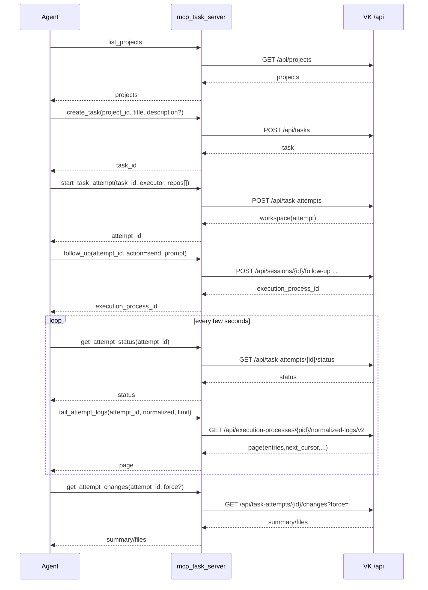

# Vibe Kanban MCP：agent 常用链路（闭环）

这份说明写给“会自己调用工具”的客户端：LLM agent、外部编排器、脚本机器人。我的目标不是把所有能力都塞进 MCP，而是用最少的 tool，把一次 attempt 从启动到收尾跑完，并且能看见三样东西：**状态、日志、改动**。

如果你只记一件事：`get_attempt_status → tail_attempt_logs → get_attempt_changes`。

## 术语（我在 MCP 里怎么理解）

- `attempt_id`：一次任务执行的 workspace id。MCP 里统一叫 attempt。
- `session_id`：一次会话/执行上下文。`follow_up` 会把 prompt 丢给它。
- `execution_process_id`：一次具体的执行进程。日志挂在 process 上。
- `state`：`idle | running | completed | failed`。这里的“相关进程”不包含 devserver（devserver 太长寿，另走 UI/专用流更合适）。

## 工具总览（常用的那一小撮）

控制面（创建/启动）：
- `list_projects` / `list_repos`
- `list_tasks` / `get_task` / `create_task` / `update_task` / `delete_task`
- `start_task_attempt`（会自动把 task 置为 `inprogress`，不要再 `update_task` 去改状态）
- `follow_up`（`send | queue | cancel`）

观测面（闭环三件套）：
- `get_attempt_status`
- `tail_attempt_logs`
- `get_attempt_changes`

补充：
- `get_context` 只有在 MCP 进程能拿到 workspace context 时才会出现；外部编排器一般别依赖它。

## 从零跑起来：我常用的启动链路

1. `list_projects`：拿到 `project_id`
2. `list_repos(project_id)`：选要跑的 repo（拿 `repo_id`，记好 `target_branch`）
3. `create_task(project_id, title, description?)`：拿到 `task_id`
4. `start_task_attempt(task_id, executor, repos[])`：拿到 `attempt_id`
5. `follow_up(action=send, attempt_id, prompt)`：把第一条指令发过去

`follow_up` 偶尔会报“attempt 没 session”。我一般不纠结：先 `get_attempt_status`，看到 `latest_session_id` 出来了再重试一次 `follow_up`。

## 闭环：状态 → 日志 → 改动

我一般跑两个节奏：
- **快循环（2–5s）**：`get_attempt_status`，如果 `running` 就 `tail_attempt_logs` 拉尾部。
- **慢循环（完成/失败时）**：`get_attempt_changes` 看 summary 和文件列表。

### 1) get_attempt_status：先判断该不该“追”

我主要盯这几个字段：
- `state`：`idle/running/completed/failed`
- `latest_session_id`：`follow_up` 需要它（你也可以直接用 `attempt_id` 让 server 帮你 resolve）
- `latest_execution_process_id`：`tail_attempt_logs` 会用到（工具内部会先 resolve）
- `last_activity_at`：判断是不是“真卡住了”
- `failure_summary`：只当提示，不当结论。要知道细节，还是看日志。

### 2) tail_attempt_logs：pull 模式尾随 + 需要自己去重

参数我常这样用：
- `channel`：默认 `normalized`（LLM 更好读）；卡住了再切 `raw`
- `limit`：50 或 100（服务端会做 cap）
- `cursor`：用来翻“更旧的一页”，不是用来拿新日志

关键点：每次 `cursor=None` 都是“最近 N 条”。为了不重复处理，我会按 `entry_index` 去重。

一个够用的策略：
1. 第一次：`cursor=None`，读完后记录 `max_seen_entry_index`
2. 后续轮询：继续 `cursor=None`，只处理 `entry_index > max_seen_entry_index` 的条目
3. 如果返回的 `execution_process_id` 变了（换了新进程），把 `max_seen_entry_index` 清零重新来

想补历史上下文时再用 `cursor`：
- 用上一次返回的 `page.next_cursor` 作为下一次请求的 `cursor`，就能拿到更旧的一页。

### 3) get_attempt_changes：先看 summary，再决定要不要 force

返回的重点是：
- `summary`：`file_count/added/deleted/total_bytes`
- `blocked` + `blocked_reason`：guard 触发时，`files` 会是空
- `files`：只给路径，不给内容；多 repo attempt 会做 repo 前缀，例如 `repo_name/path/to/file`

我一般这么用：
- 先不 force，拿 summary 做判断
- 真要文件列表（比如要挑几个关键文件 review），再 `force=true` 复查一次

## 一张图：我怎么把它串起来

```mermaid
flowchart TD
  A[list_projects] --> B[list_repos]
  B --> C[create_task]
  C --> D[start_task_attempt]
  D --> E[follow_up: send prompt]
  E --> F{get_attempt_status.state}
  F -->|idle| G[等待 session/process\n或重试 follow_up]
  F -->|running| H[tail_attempt_logs\n(normalized, cursor=None)]
  H --> F
  F -->|completed| I[get_attempt_changes\n(force?)]
  F -->|failed| J[tail_attempt_logs(raw?)\nget_attempt_changes]
  I --> K[update_task: inreview/done]
  J --> K
```

## 另一张图：调用顺序（MCP 视角）



## 我自己踩过的坑（简短版）

- `failure_summary` 只是“这次大概怎么死的”，真正的原因还是得看 logs。
- `tail_attempt_logs` 是 pull 模式，别指望它帮你“增量推送”。要增量，就自己按 `entry_index` 去重。
- `get_attempt_changes` 被 guard 挡住很常见：先看 summary，再决定要不要 force，别上来就 force。

## 逆推：agent 场景下，MCP 还可能需要哪些“非 UI”能力？

这部分是从上面的闭环链路往回推：人类点页面可以“看见并手动处理”，但 agent 要做到稳定自动化，往往需要更**结构化、可重试、可批量**的能力。

### 1) 机器编排能力（UI 不一定需要，但 agent 很需要）

- **能力发现**：`list_executors`（或 `list_executor_profiles`），返回可用 executor/variant、是否支持 MCP、默认 variant。避免 agent 写死字符串导致线上“换配置就挂”。
- **幂等与去重**：对 `create_task` / `start_task_attempt` / `follow_up(queue)` 增加 `request_id`（幂等键），让 orchestrator 可以放心重试而不重复创建任务/attempt/队列消息。
- **批量/增量同步**：对“高频轮询面”提供减少 round-trip 的方式：
  - `get_attempt_status` 支持 `attempt_ids: []` 批量；
  - `list_tasks` 支持 `updated_since`（或 `cursor`）做增量拉取；
  - 或做一个 `wait_for_attempt_change(attempt_id, since, timeout_ms)` 的 long-poll（比 WS/SSE 更容易在 agent 里落地）。
- **结果结构化**：给 attempt 一个“收尾摘要”字段（例如 `result_summary` / `exit_code` / `last_error_code` / `recommended_next_action`），便于外部编排器自动把任务分流到 `done`/`inreview`/`needs_follow_up`。

### 2) UI 对等能力（如果希望 agent 完全替代人点页面）

- **停止/打断**：`stop_attempt(attempt_id, force?)`，对应 UI 上的 Stop，用来处理卡死/跑飞的执行进程（`follow_up(cancel)` 只取消队列，不等于停正在跑的进程）。
- **对话回放**：`tail_session_messages(session_id, cursor/limit)`（或 `get_session_transcript`），让 agent 能读到历史指令/工具输出，支持“自我纠错”“继续上次未完成的 follow-up”。
- **产物读取**：在 `get_attempt_changes` 之上补一个“按需取内容”的能力：
  - `get_attempt_patch(attempt_id, paths[], guard=...)` 或 `get_attempt_file(attempt_id, path, max_bytes=...)`；
  - 核心是**可控上限**（size guard）+ **明确 blocked reason**，避免把大 diff 直接塞爆上下文。
- **Git 收尾动作**（可选）：`push_attempt` / `create_pr` / `merge_attempt` / `rebase_attempt`。这些 UI 已经有，但是否放进 MCP，取决于你是否允许 agent 自动“交付到远端/主干”。

  ## 通用约定（所有 tools 共用）

  - id：project_id/repo_id/task_id/attempt_id/session_id/execution_process_id 均为 uuid string
  - 时间：rfc3339 string
  - 分页：cursor（不透明字符串）+ limit；返回 next_cursor/has_more
  - detail：0|1|2（默认 0，越大字段越多）
  - request_id（可选但强烈建议）：幂等键（string/uuid 均可）
      - 同一 tool+action+request_id：重复调用返回同一结果
      - 同一 request_id 但 payload 不同：返回 conflict 错误
  - blocked/truncated：大内容统一用 blocked/blocked_reason 或 truncated=true，并返回“建议缩小范围”的 hint（避免爆上下文）

  ———

  ## 工具总览（建议最终保留这些）

  发现/配置

  1. list_projects
  2. list_repos
  3. list_executors

  任务（看板对象）
  4) list_tasks
  5) get_task
  6) task_write（create/update/delete 三合一）

  attempt（执行闭环）
  7) start_task_attempt
  8) attempt_control（follow_up + stop/kill + 轻量控制合并）
  9) get_attempt_status（支持 batch + long-poll wait）
  10) tail_attempt_logs（支持 after_entry_index 增量）
  11) get_attempt_changes（summary + changed files + guard/force）
  12) get_attempt_artifact（patch/file/transcript 三合一）

  可选（允许 agent 交付到远端时）
  13) attempt_git_action（push/create_pr/merge/rebase）

  可选（仅本地容器上下文可用）
  14) get_context

  ———

  # 1) list_projects

  Request

  - cursor?, limit?=50, detail?=0

  Response

  - projects: [{project_id,name,updated_at}]
  - next_cursor?, count

  Logic

  - cursor 为空：返回最新一页；不为空：从 cursor 位置继续
  - detail>=1：额外带 created_at 等元数据

  ———

  # 2) list_repos

  Request

  - project_id (required)
  - detail?=0

  Response

  - repos: [{repo_id,repo_name}], count

  Logic

  - detail>=1：可加 default_branch / repo path 摘要（避免 agent 写死）

  ———

  # 3) list_executors（能力发现：给 agent 用）

  Request

  - detail?=0
  - include_variants?=true
  - capabilities_filter?（可选，比如只要 supports_mcp=true）

  Response（detail=0 最小）

  - executors: [{executor,variants?}]

  Response（detail>=1）

  - 每个 executor 增加：
      - supports_mcp, supports_follow_up_queue, supports_pr, supports_dev_server
      - default_variant?, recommended_for?（如 coding|review|ops）

  Logic

  - include_variants=false：只返回 executor 名，省 token
  - capabilities_filter：服务端过滤，避免客户端二次筛选

  ———

  # 4) list_tasks（支持增量同步）

  Request

  - project_id (required)
  - status?：todo|inprogress|inreview|done|cancelled
  - q?：标题（可选扩展到 description，但默认只 title，省 token）
  - updated_since?：rfc3339（增量拉取）
  - cursor?, limit?=50
  - detail?=0
  - include_attempt_summary?=true

  Response（detail=0 最小）

  - tasks: [{task_id,title,status,updated_at,attempt_summary?}]
  - next_cursor?, count

  attempt_summary（默认带，给编排器用）：

  - latest_attempt_id?
  - latest_session_id?
  - has_in_progress_attempt: bool
  - last_attempt_failed: bool

  Logic

  - status：按列过滤
  - q：title contains（大小写可选不敏感）
  - updated_since：只返回 updated_at > updated_since
  - cursor：用于翻页；可和 updated_since 同时用（等价于在过滤结果集里翻页）
  - detail>=1：attempt_summary 扩展到 latest_workspace_branch/latest_session_executor 等

  ———

  # 5) get_task（可选带 attempts，减少一个 list_tool）

  Request

  - task_id (required)
  - detail?=1
  - include_attempts?=false
  - attempts_cursor?, attempts_limit?=20

  Response

  - task: {task_id,title,description?,status,created_at,updated_at,...}
  - 若 include_attempts=true：
      - attempts: [{attempt_id,workspace_branch,created_at,latest_session_id?,latest_session_executor?}]
      - attempts_next_cursor?

  Logic

  - include_attempts=false：只读 task 本体（省 token）
  - include_attempts=true：按 created_at desc 分页返回 attempts

  ———

  # 6) task_write（create/update/delete 合并 + request_id 幂等）

  Request

  - op (required): create|update|delete
  - request_id?

  op=create 需要：

  - project_id, title, description?

  op=update 需要：

  - task_id, title?, description?, status?

  op=delete 需要：

  - task_id

  Response

  - create: {task_id}
  - update: {task}
  - delete: {deleted_task_id}（重复 delete 也应返回同样结果或 null + ok）

  Logic

  - 根据 op 分发到不同写路径
  - request_id 存在时：同 request 重试不重复创建/更新

  ———

  # 7) start_task_attempt（支持“复用运行中 attempt”避免重复跑）

  Request

  - task_id (required)
  - executor (required)（来自 list_executors）
  - variant?
  - repos: [{repo_id,target_branch}] (required)
  - request_id?
  - reuse_running_attempt?=false（编排器开关）
  - branch_prefix?（可选，便于排查/归档）

  Response

  - {attempt_id,workspace_branch,task_id,latest_session_id?}

  Logic

  - reuse_running_attempt=true 且存在 in-progress attempt：直接返回那一个（避免 Zirvox/agent 重复启动）
  - 否则创建新 workspace/attempt，并把 task 自动置为 inprogress

  ———

  # 8) attempt_control（把 follow_up + stop 合并，减少 tool 数）

  Request

  - action (required): send|queue|cancel|stop|kill
  - request_id?

  目标选择（按 action 不同）

  - send|queue|cancel：需要 session_id 或 attempt_id
      - session_id 优先；否则用 attempt_id resolve latest_session
  - stop|kill：需要 execution_process_id 或 attempt_id
      - execution_process_id 优先；否则 stop latest “非 devserver” 运行进程

  附加字段

  - prompt：send|queue 必填
  - variant?：可覆盖 session 默认 variant（可选）
  - force?：对 stop 可选；也可直接用 kill

  Response（最小）

  - action
  - session_id?（如果发生了 resolve）
  - execution_process_id?（send 会返回；stop/kill 可能返回被停的 pid）
  - queue_status?（queue/cancel）
  - stopped? + message?

  Logic

  - send：立刻触发一次 follow-up 执行，返回新的 execution_process_id
  - queue：只入队，不启动执行（agent 不维护 WS/SSE 的前提下更稳）
  - cancel：取消队列消息（不影响已在跑的进程）
  - stop：优雅停止（可实现为 SIGTERM + 超时）
  - kill：强杀（SIGKILL）

  ———

  # 9) get_attempt_status（支持 batch + long-poll）

  Request

  - 单个：attempt_id
  - 批量：attempt_ids: []
  - detail?=0
  - include_result?=true
  - wait?（仅单个建议支持）：
      - since_token（上次返回的 token）
      - timeout_ms=30000

  Response（单个，detail=0 最小）

  - attempt_id
  - state: idle|running|completed|failed
  - latest_session_id?
  - latest_execution_process_id?
  - last_activity_at?
  - failure_summary?
  - result?（include_result=true 时，completed/failed 才有意义）
  - token（不透明字符串，用于 long-poll）

  result（结构化收尾摘要，给编排器分流用）

  - outcome: success|failure|cancelled|unknown
  - summary（短句）
  - finalized_at?
  - recommended_next_action?: follow_up|review_changes|stop|retry|mark_inreview|mark_done

  Logic

  - batch 模式：一次返回多个 attempt 的最小状态（省轮询 round-trip）
  - wait 模式：如果 since_token == current_token，阻塞直到 token 变化或超时；变化条件建议覆盖：
      - state 变化 / latest_session_id 变化 / latest_execution_process_id 变化 / last_activity_at 变化

  ———

  # 10) tail_attempt_logs（支持增量 after_entry_index，减少重复 token）

  Request

  - attempt_id (required)
  - channel?=normalized|raw（默认 normalized）
  - limit?=100（服务端 cap）
  - 分页二选一：
      - cursor?：翻更旧历史
      - after_entry_index?：只要“新于某 index 的日志”（推荐给 agent 轮询）

  Response

  - attempt_id
  - execution_process_id?
  - channel
  - entries: [{entry_index,entry}]（entry 为结构化 JSON）
  - next_cursor?, has_more, history_truncated
  - latest_entry_index?（便于客户端保存）

  Logic

  - after_entry_index 存在：返回 entry_index > after_entry_index 的新增日志（最多 limit）
  - 否则：
      - cursor 为空：返回最近 N 条（tail）
      - cursor 不为空：返回更旧一页（历史回溯）

  ———

  # 11) get_attempt_changes（summary + 文件清单 + guard/force）

  Request

  - attempt_id (required)
  - include_files?=true
  - force?=false
  - detail?=0（是否返回 per-file stats）

  Response

  - summary: {file_count,added,deleted,total_bytes}
  - blocked: bool
  - blocked_reason?: summary_failed|threshold_exceeded|too_many_files
  - files: [path]（blocked 时为空）
  - file_stats?（detail>=1）

  Logic

  - 永远尽量先算出 summary
  - include_files=false：只返回 summary（最省 token）
  - blocked=true && force=false：文件清单置空
  - force=true：绕过阈值，但仍可保留绝对上限（防止服务端/模型被打爆）

  ———

  # 12) get_attempt_artifact（patch/file/transcript 三合一）

  Request

  - kind (required): patch|file|transcript
  - detail?=0
  - max_bytes?=20000（默认小，避免上下文污染）

  kind=patch：

  - attempt_id (required)
  - paths?: [string]（强烈建议必须传；不传就按 changed files 但会更容易 blocked）
  - guard?: {max_files?,max_total_bytes?}

  kind=file：

  - attempt_id (required)
  - path (required)
  - range?: {start_line,end_line}（建议默认走 range）
  - encoding?=utf-8

  kind=transcript：

  - session_id? 或 attempt_id?（用 attempt_id 时 resolve latest_session）
  - cursor?, limit?=50

  Response

  - patch: {blocked,blocked_reason?,patch_text?,truncated?}
  - file: {blocked,blocked_reason?,content?,truncated?}
  - transcript: {messages:[{role,content,at,type?}],next_cursor?,has_more}

  Logic

  - patch/file 都必须强 guard：超过就 blocked=true 并提示“缩小 paths/range/max_bytes”
  - transcript：分页拉取，避免一次把全对话塞进来

  ———

  # 13) attempt_git_action（可选：允许 agent 交付时再开）

  Request

  - action (required): push|create_pr|merge|rebase
  - attempt_id (required)
  - repo_id (required)
  - request_id?

  action-specific：

  - push: force?=false
  - create_pr: title?, body?, base_branch?, draft?=true
  - merge: method?=squash|merge|rebase
  - rebase: new_base_branch?, old_base_branch?, abort?=false

  Response（示例字段）

  - push：{pushed,remote_branch,head_oid}
  - create_pr：{pr_url,pr_number}
  - merge：{merged,merge_commit?}
  - rebase：{status: ok|conflicts|in_progress, conflicted_files?}

  Logic

  - 按 action 分发到对应 git 操作；冲突/需人工介入时返回结构化状态（别只给长文本）

  ———

  # 14) get_context（可选）

  Request：无
  Response：当前容器目录关联的 {project,task,attempt,workspace_repos}
  Logic：仅当 MCP 进程“确实处在某个 attempt workspace”时可用；外部 orchestrator 不应依赖。

  ———
