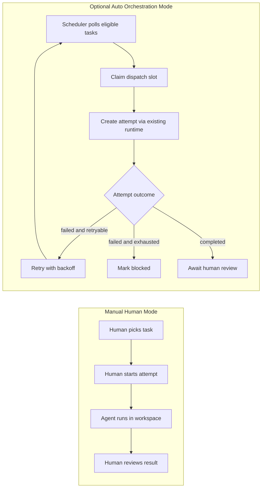
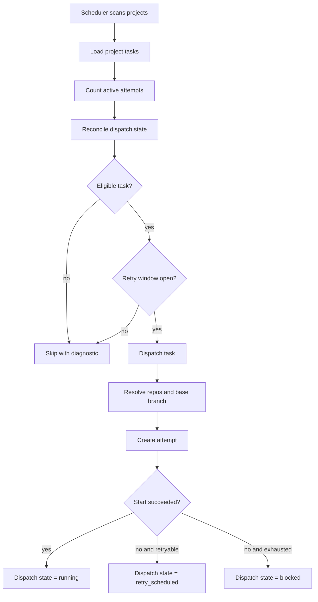

# Optional Auto Orchestration for `vk`

This document captures the first implementation of Symphony-style “less babysitting” execution inside `vk`, while preserving the current human-driven workflow.

## Goal

- Keep existing manual task execution unchanged by default.
- Add an opt-in project mode that can automatically pick eligible internal tasks, create attempts, retry failures, and hand back tasks for human review.
- Reuse the current `task -> workspace -> session -> execution_process` runtime pipeline instead of introducing a parallel executor stack.

## Concept Comparison

## Data Model Changes

### `Project`

Project-level controls make orchestration optional and coarse-grained:

- `execution_mode: manual | auto`
- `scheduler_max_concurrent: number`
- `scheduler_max_retries: number`

Manual remains the default for both existing and new projects.

### `Task`

Tasks now support task-level automation override on top of the project mode:

- `automation_mode: inherit | manual | auto`
- `effective_automation_mode` is derived from task override + project execution mode
- `origin_task_id` links agent-created follow-up work back to its originating task
- `created_by_kind: human_ui | mcp | scheduler | agent_followup` preserves where the task came from
- task DTOs include automation diagnostics and dispatch summary for UI and MCP callers
- follow-up/source metadata is preserved with `origin_task_id` and `created_by_kind` for linked task context

### `TaskDispatchState`

A new persisted task dispatch record tracks scheduler ownership and retry lifecycle:

- `controller: manual | scheduler`
- `status: idle | claimed | running | retry_scheduled | awaiting_human_review | blocked`
- `retry_count`, `max_retries`
- `last_error`, `blocked_reason`
- `next_retry_at`, `claim_expires_at`

## Runtime Flow

## What `vk` Gains

- Optional “少盯盘” project mode without removing human control.
- Built-in polling scheduler for internal task pool.
- Task-level `inherit | manual | auto` override so human and managed modes can coexist.
- Automatic retry scheduling with bounded exponential backoff.
- Persisted blocked / retry / review state per task.
- Structured “why not scheduled” diagnostics in API, MCP, and UI.
- Auto-run attempt creation using the existing workspace/session runtime.
- Project switch UX and task override UX for manual vs auto visibility.
- A `vk`-native unattended orchestration prompt adapted from Symphony patterns.

## Current Scope

Included in this first version:

- Internal `vk` tasks only.
- Project-level opt-in orchestration.
- Task-level `inherit | manual | auto` override.
- Retry / blocked / awaiting-review lifecycle.
- Project settings switch and task-level automation controls.
- Diagnostics in task list/detail views and MCP surfaces.
- Auto-managed prompt rendering with task/project/repository/attempt context.

Not yet included:

- External tracker ingestion (Linear / Jira / GitHub Issues).
- Task-group dependency-aware scheduling.
- Pause / resume or richer orchestration dashboards.
- Proof-bundle or richer execution quality gates.

## MCP Automation Policy

- MCP callers may request task-level `automation_mode=inherit | manual | auto` during create or update.
- Those requests affect the task only; they do not silently change the owning project's `execution_mode`.
- Project-wide auto orchestration remains an explicit project-level choice.
- Follow-up tasks created by agents or MCP callers should include `origin_task_id` so operators can inspect lineage in API, MCP, and UI surfaces.
- If `origin_task_id` is provided without `created_by_kind`, `vk` treats the task as `agent_followup` by default.
- If `created_by_kind=agent_followup`, `origin_task_id` is required.
- MCP reads expose both `project_execution_mode` and `effective_automation_mode` so callers can see whether the task will actually run under auto orchestration.

## Follow-up Task Attribution

To keep agent-created related work understandable to humans, task records now preserve lightweight lineage metadata:

- `origin_task_id`: points back to the task that spawned this follow-up work.
- `created_by_kind: human_ui | mcp | scheduler | agent_followup`: explains where the task came from.
- Task detail surfaces this via a lineage card so operators can jump to the parent task or inspect spawned follow-up tasks without reading logs.

## MCP Automation Policy

MCP callers use the same task mutation surface as the UI, but with explicit safety rules:

- `create_task` and `update_task` may request task-level `automation_mode=auto`.
- A task-level `auto` request does **not** silently change `project.execution_mode`; project-wide auto remains an explicit project setting.
- In a manual project, a task can still opt into `auto` and become scheduler-eligible when other conditions pass.
- MCP-created follow-up work should include `origin_task_id`; if `origin_task_id` is supplied without `created_by_kind`, `vk` records it as `agent_followup`.
- `created_by_kind=agent_followup` without `origin_task_id` is rejected so lineage never becomes ambiguous.

## Operational Notes

- Auto mode uses the configured executor profile already used by the application.
- Base branch resolution prefers `github.default_pr_base`, then `main`, then `master`.
- Group tasks and grouped child tasks are intentionally skipped for now to avoid dependency-order bugs.
- Scheduler scans all projects so a task-level `auto` override can still run inside an otherwise manual project.
- Manual flows still work; auto mode is an additive scheduler, not a replacement runtime.
