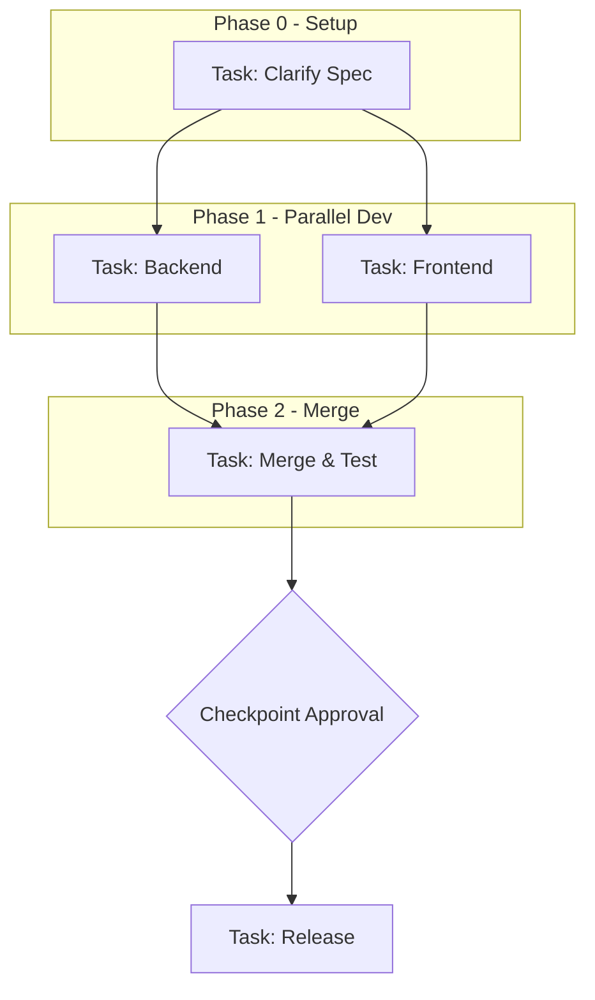
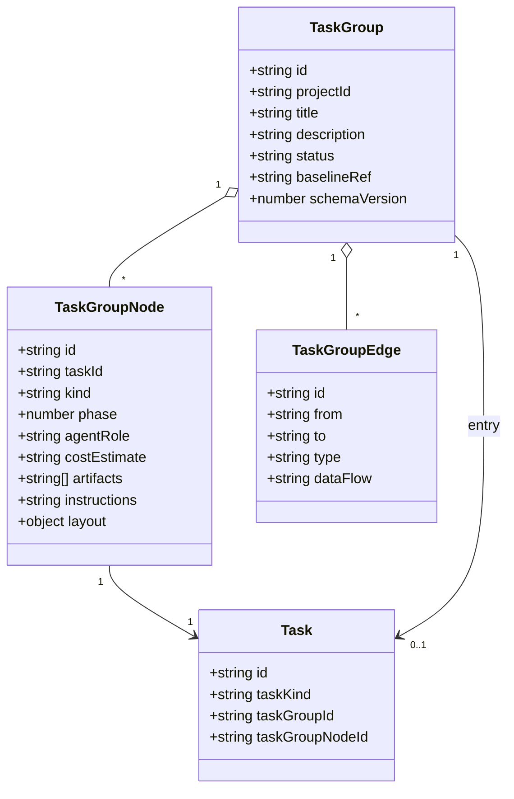

## Context
The workflow view is a human-friendly UI for a structured TaskGroup. A TaskGroup makes parallel agent work deterministic by turning implicit planning into an explicit DAG asset. TaskGroups are scoped to a Project and map 1:1 to Tasks via nodes. Dependencies are hard blockers in v1.

## Goals / Non-Goals
- Goals:
  - Provide project-scoped TaskGroups with DAG nodes and edges.
  - Enforce blocker dependencies and prevent cycles.
  - Keep node status aligned with Task status.
  - Support phases (logical batches), checkpoints, and merge nodes.
  - Expose TaskGroups through a workflow view for editing and monitoring.
- Non-Goals:
  - Conditional branching or dynamic workflows.
  - Automatic conflict resolution or auto-merge.
  - Cross-project TaskGroups.

## Decisions
- Storage: Persist a first-class TaskGroup entity per Project (not embedded in Project config). Store the DAG as a JSON payload with a schema version for future migration.
- Kanban entry: Represent a TaskGroup with an optional Task (`taskKind=group`, `taskGroupId`) to allow listing in Kanban and direct entry to the workflow view.
- Mapping: Each node references exactly one Task; Task stores `taskGroupNodeId` when linked.
- Dependencies: All edges are blocker edges in v1. A node can only become Ready when all predecessors are Done.
- Node kinds: `task`, `checkpoint`, `merge` (merge is a task node used for integration and testing). Merge nodes default to no approval, but can opt in.
- Node metadata: Include `agentRole`, `costEstimate`, `artifacts`, and optional `instructions` to capture planning intent.
- Node layout: Persist `x` and `y` coordinates for the workflow view.
- Agent selection: If no active agent matches `agentRole`, allow manual selection before starting the task.
- Phases: Integer phase values represent logical batches; dependencies are still explicit edges.
- Baseline: TaskGroup records a `baselineRef` (branch or commit) for consistent worktree creation.
- Naming: TaskGroup stores `title` and optional `description` for display even when no entry task exists.
- Status: TaskGroup stores `status` (TaskStatus values) and is user-controlled; node progress does not auto-update this field. The system provides a derived `suggestedStatus` for UI display.
- Interruption UX: Mirror the existing Task page actions (Stop + Force Stop). Stop always calls the non-force endpoint; if graceful interrupt is unavailable, the backend falls back to force kill without extra UI mode labels.

## Schema Sketch
```json
{
  "id": "task_group_123",
  "projectId": "project_abc",
  "title": "Plan and Build Workflow View",
  "description": "Split tasks and track dependencies",
  "status": "inprogress",
  "suggestedStatus": "inreview",
  "baselineRef": "main",
  "schemaVersion": 1,
  "nodes": [
    {
      "id": "node_a",
      "taskId": "task_a",
      "kind": "task",
      "phase": 1,
      "agentRole": "Backend-Agent",
      "costEstimate": "2h",
      "artifacts": ["api-spec.md"],
      "instructions": "Implement API endpoints per spec",
      "layout": {"x": 120, "y": 240}
    },
    {
      "id": "node_gate",
      "taskId": "task_gate",
      "kind": "checkpoint",
      "phase": 2,
      "requiresApproval": true,
      "layout": {"x": 400, "y": 240}
    }
  ],
  "edges": [
    {
      "id": "edge_a_gate",
      "from": "node_a",
      "to": "node_gate",
      "type": "blocker",
      "dataFlow": "API contract"
    }
  ]
}
```

## Diagram: Sample TaskGroup DAG


## Diagram: Data Model


## Schema Fields (DB)
TaskGroups:
- `id` (uuid, pk)
- `project_id` (uuid, fk projects.id)
- `title` (text, required)
- `description` (text, nullable)
- `status` (text, required)
- `baseline_ref` (text, required)
- `schema_version` (integer, required)
- `graph_json` (jsonb, required; nodes, edges, layout)
- `created_at`, `updated_at` (timestamp)

Tasks additions:
- `task_kind` (text, default `default`)
- `task_group_id` (uuid, nullable, fk task_groups.id)
- `task_group_node_id` (text, nullable; references node id inside graph_json)

Suggested constraints:
- Unique entry task per task group: `(task_group_id)` where `task_kind=group`
- A task belongs to at most one node: unique `(task_group_node_id)`

Derived fields (API):
- `suggested_status` (text, derived from node states; not persisted)

## Migration Notes
- Add `task_groups` table with `graph_json` and `schema_version`.
- Add nullable `task_group_id` and `task_group_node_id` to tasks; add `task_kind` with default `default`.
- Backfill is not required; existing tasks remain `default` with null group fields.
- Add indexes on `task_group_id` and `task_group_node_id` for lookup.

## Discovery Findings: Interruption & Hooks (current executors)
- Claude Code: supports hook configuration via `get_hooks()` (PreToolUse callbacks for approvals) and exposes `interrupt_sender` for graceful interrupt before kill. (`crates/executors/src/executors/claude.rs`)
- Codex: uses app server protocol with approval policies but does not expose hook configuration; `interrupt_sender` is `None`. Stop is handled via process kill after best-effort interrupt attempt. (`crates/executors/src/executors/codex.rs`)
- Container stop path: `POST /task_attempts/:id/stop` triggers `try_stop` / `try_stop_force`; both result in `ExecutionProcessStatus::Killed`, with optional graceful interrupt if available. (`crates/server/src/routes/task_attempts.rs`, `crates/services/src/services/container.rs`)

## Discovery Findings: React Flow integration
- Package: React Flow is installed as `@xyflow/react`. The stylesheet import is required for the component to render correctly.
- Core component: `<ReactFlow />` takes `nodes`, `edges`, and event handlers (`onNodesChange`, `onEdgesChange`, `onConnect`). `fitView` is used to auto-fit content.
- State helpers: `useNodesState` / `useEdgesState` are recommended for managing node/edge state; `addEdge` and change helpers apply updates.
- Layout: The ReactFlow parent element must have explicit width/height.
- Provider: `ReactFlowProvider` is required when using hooks like `useReactFlow` or when accessing flow state outside the ReactFlow component.
Sources: `https://reactflow.dev/learn`, `https://reactflow.dev/learn/advanced-use/hooks-providers`
## Risks / Trade-offs
- JSON storage eases iteration but limits querying; may need a normalized table in later versions.
- Hard blockers simplify semantics but may be too rigid for future conditional flows.
- Checkpoints add manual steps; misuse can slow progress.

## Open Questions
- Should phase ordering be enforced (no edges from higher phase to lower phase)?
- Do we need per-edge artifacts (input/output) beyond a single `dataFlow` label?
